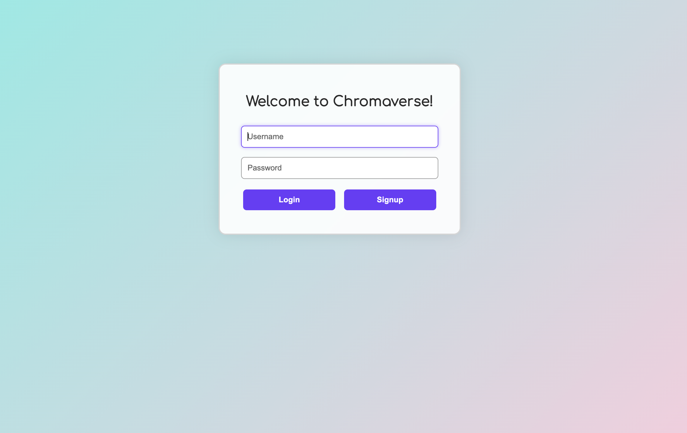
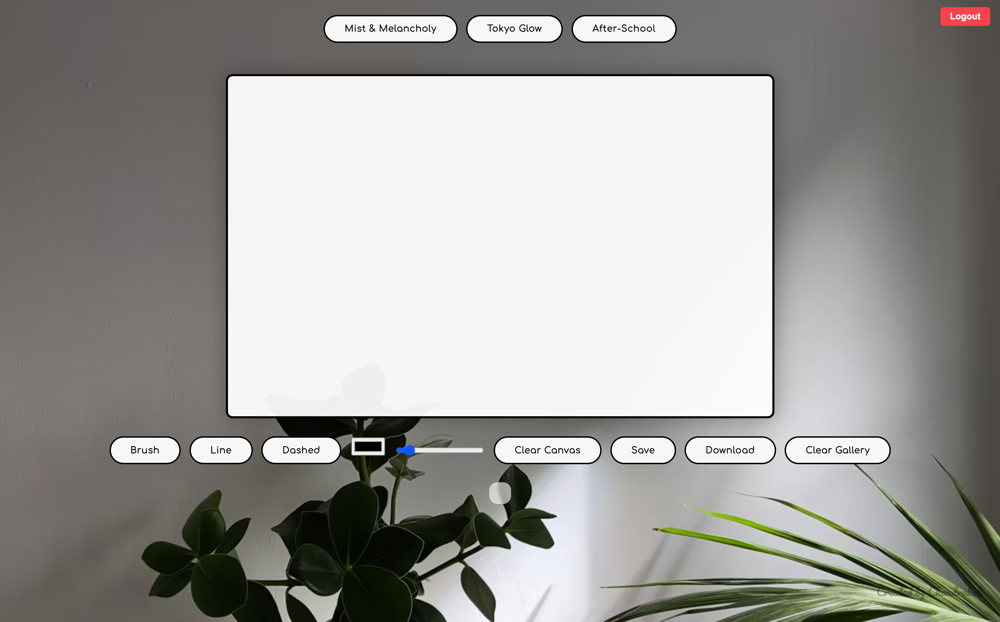

# Chromaverse

Welcome to **Chromaverse** — an immersive web app where you can draw, save, and showcase your artworks in your personal gallery — in different themes. Auth and data storage are handled seamlessly using Firebase.

## Live Demo

Check it out here: [chromaverse.onrender.com](https://chromaverse.onrender.com)

  
   
  <em>Login/Signup Page</em>

  
   
  <em>Theme-1</em>

  
   
  <em>Theme-2</em>

  
   
  <em>Theme-3</em>

## Features

### Drawing Canvas

- Freehand drawing with brush, line, and dashed modes
- Adjustable color picker and line width slider
- Clear canvas and download options

### Theme Switching

- Instantly switch between custom themes:
  - Mist & Melancholy
  - Tokyo Glow
  - After-School
- Dynamic background and UI changes in real time

### Gallery & Save

- Save your artwork to your personal gallery in **Firestore**
- View all saved pieces in a scrollable gallery
- Clear gallery feature for a fresh start

### Authentication

- Login and signup powered by **Firebase Authentication**
- Secure session management using Firebase tokens
- Only authenticated users can access the drawing board and gallery

## Tech Stack

- **HTML**, **CSS**, **JavaScript**
- **Node.js**, **Express.js** for server setup
- **Firebase Auth** for secure authentication
- **Firebase Firestore** for storing gallery metadata
- **Canvas API** for drawing logic
- **Docker** for containerization
- **Render** for smooth, scalable deployment

## Deployment

- Containerized using Docker for portability
- Deployed on Render, enabling public access
- Firebase service keys are managed securely

> "Creativity is intelligence having fun." — Albert Einstein
